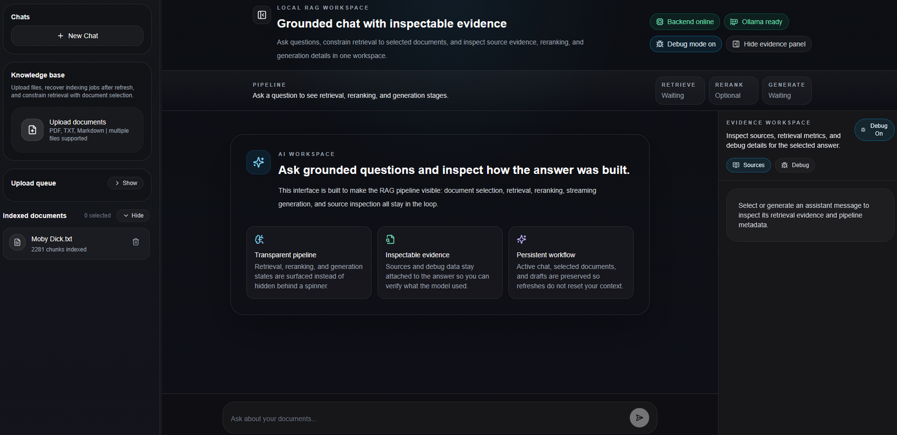
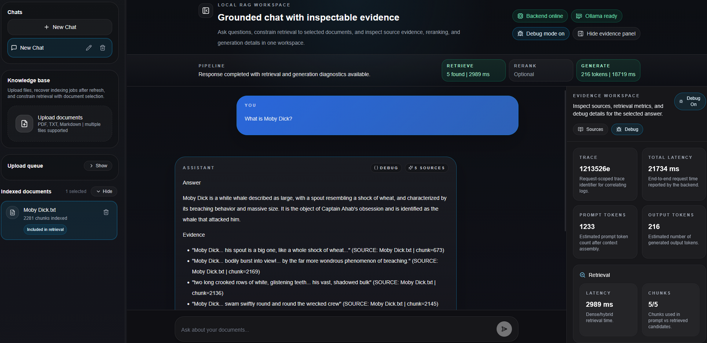
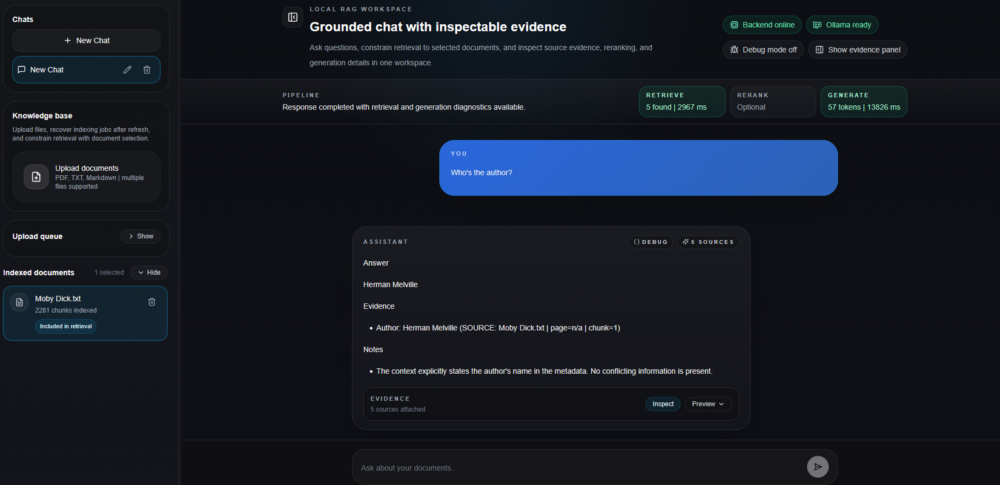

# Local RAG Workspace

## Project Summary

**Local RAG Workspace** is a local-first, full-stack RAG portfolio project - an engineering artifact built to show how retrieval-augmented generation works end to end, not a hosted “chat with your docs” product.

|             |                                                                 |
| ----------- | --------------------------------------------------------------- |
| **Stack**   | FastAPI · Next.js · Ollama · ChromaDB · SQLite                  |
| **Purpose** | Inspectable RAG with sources, pipeline stages, and debug traces |
| **Runtime** | Single-user, runs entirely on your machine                      |

Upload documents, ask grounded questions, constrain retrieval to selected files, stream answers over SSE, and inspect retrieval scores, reranking, prompt assembly, and generation metadata in the UI. Every major pipeline stage is visible in code and in the **Evidence Workspace** panel.

See [`docs/ENGINEERING_NOTES.md`](docs/ENGINEERING_NOTES.md) for batch-by-batch implementation history and validation commands.

## Engineering Highlights

- **Structure-aware chunking** - Markdown headings, PDF page metadata, section paths on every chunk
- **Dense retrieval** - semantic search baseline via Ollama embeddings + ChromaDB
- **Optional hybrid BM25 + RRF** - lexical + dense merge for exact-term and identifier matches
- **Optional heuristic reranking** - local post-retrieval reordering without a cross-encoder dependency
- **Strict grounded prompting** - answers must cite retrieved context; explicit refusal when evidence is missing
- **SSE streaming** - token-by-token generation with structured error events
- **Upload recovery** - SQLite job queue, startup re-enqueue, Chroma rollback on partial failure, frontend retry
- **Persisted debug metadata** - retrieval/rerank/prompt/generation debug survives page reload in SQLite
- **Local eval harness** - fixture dataset, recall@k, offline mode with `--fake-embeddings`
- **Playwright smoke demo** - one local E2E test for upload → chat → sources → persisted debug (not CI)
- **Optional multi-turn query rewriting** - chat history rewrites the retrieval query only; final answers stay document-grounded

## Demo Flow

Use this path for interviews, portfolio walkthroughs, or the Playwright smoke test.

1. **Start Ollama** on the host (`ollama serve`) and pull models (e.g. `llama3.2:1b`, `nomic-embed-text`).
2. **Start the backend** - `uvicorn` on port 8000 or Docker `rag-backend` with `OLLAMA_BASE_URL=http://host.docker.internal:11434`.
3. **Start the frontend** at `http://localhost:3000` (`npm run dev` or Docker `rag-frontend`).
4. **Upload a fixture document** - e.g. `scripts/eval_data/docs/limitations.md` from the sidebar uploader.
5. **Wait for indexing** - upload queue reaches completed; document appears under **Indexed documents**.
6. **Ask a grounded question** - e.g. _“Does PDF handling include OCR?”_ with the document selected.
7. **Inspect sources and debug** - open **Evidence Workspace → Sources** and **Debug** (retrieval, used-in-prompt chunks, optional query rewrite).
8. **Reload the page** - confirm chat history and debug metadata persist on the assistant message.
9. **Run the smoke demo** (optional) - from `frontend/`: `npm run test:e2e` (requires Ollama, backend, and frontend running).

For follow-up rewriting, set `ENABLE_QUERY_REWRITING=true` in `backend/.env`, restart the backend, ask a first question in a chat, then a pronoun-style follow-up (e.g. _“Is it enabled by default?”_) and check **Query Rewriting** in the Debug tab.

## Screenshots

<p align="center">
  
</p>

<p align="center">
  
  
</p>

## Why I Built It

Most RAG demos stop at "upload a file and ask a question." I wanted a project that was more useful in interviews and more realistic as an engineering artifact:

- the backend should separate ingestion from chat serving
- retrieval decisions should be visible and measurable
- the frontend should show how an answer was built, not just render text
- the whole system should run locally so infrastructure, latency, and quality trade-offs stay visible

## Architecture

```text
Upload flow
  Next.js
    -> POST /documents/upload
    -> save raw file to local storage
    -> create upload job in SQLite
    -> enqueue background indexing task
    -> load + segment document
    -> structure-aware chunking
    -> embed with Ollama
    -> store chunks in ChromaDB
    -> register document metadata

Question flow
  Next.js
    -> POST /chat or /chat/stream
    -> optional query rewrite from chat history (retrieval query only)
    -> retrieve dense or hybrid candidates
    -> optional reranking
    -> build grounded prompt from retrieved chunks + original question
    -> generate with Ollama
    -> stream tokens + sources + debug info
    -> persist chat history and debug metadata in SQLite
```

## Technical Highlights

### 1. Structure-aware chunking

The ingestion pipeline first segments documents by structure, then applies recursive splitting to stay within chunk limits.

- Markdown is split by heading hierarchy
- PDFs preserve page numbers and detect heading-like lines heuristically
- chunks carry `section_title`, `section_path`, and `page` metadata

This improves both retrieval quality and source attribution compared with pure fixed-size chunking.

### 2. Hybrid retrieval

Dense similarity search is still the baseline, but the system can optionally add local BM25 keyword search.

- dense search catches semantic matches
- BM25 helps with filenames, identifiers, exact terms, and version-like strings
- results are merged with Reciprocal Rank Fusion

This makes the retrieval pipeline more realistic than a dense-only demo while keeping everything local and lightweight.

### 3. Optional reranking

After retrieval, the system can rerank the top candidates with a lightweight local scoring function.

- improves final chunk ordering
- helps promote chunks that directly answer the question
- stays cheaper and easier to inspect than a heavy cross-encoder dependency

### 4. Observability built into the RAG path

The backend exposes structured debug data instead of hiding the pipeline behind a spinner.

Available debug data includes:

- retrieval scores, methods, and chunk IDs
- rerank rank and rerank score
- prompt length and token estimates
- generation latency and output token estimates
- total request latency and per-stage timings

The frontend surfaces this through an evidence workspace so the project demonstrates RAG debugging, not just RAG output.

### 5. Evaluation harness

The repo includes a lightweight evaluation script and a small fixture dataset.

It can measure:

- retrieval recall@k
- whether the expected chunk was retrieved
- simple answer correctness heuristics

That gives the project a measurable path for comparing chunking, retrieval, and reranking changes.

## Key Design Decisions

| Decision                                                             | Why it was chosen                                                                              | Trade-off                                                       |
| -------------------------------------------------------------------- | ---------------------------------------------------------------------------------------------- | --------------------------------------------------------------- |
| **Local-first (Ollama + ChromaDB)** instead of hosted LLM/vector DB  | Keeps the stack reproducible, inspectable, and free of vendor lock-in for a portfolio artifact | Weaker models and more manual ops than managed APIs             |
| **Split persistence** (Chroma + SQLite + JSON registry + filesystem) | Each store matches its concern and is easy to debug in isolation                               | No cross-store transactions; consistency is application-managed |
| **Query rewriting uses history for retrieval only**                  | Follow-ups can retrieve the right chunks without treating prior assistant text as evidence     | Heuristic follow-up detection; extra Ollama call when rewriting |
| **Final answers grounded only in retrieved context**                 | Makes hallucinations and missed retrievals visible and testable                                | Conservative refusals when retrieval misses                     |
| **CI/CD intentionally out of scope**                                 | Focus stays on the RAG pipeline; validation is local and scriptable                            | No automated gates on push/PR today                             |
| In-process upload queue                                              | Fast uploads without Redis/SQS                                                                 | Jobs need SQLite recovery on restart                            |
| Optional hybrid + reranking                                          | Simple dense baseline; advanced modes opt-in                                                   | More configuration surface                                      |
| Debug metadata in API and UI                                         | RAG failures become diagnosable in interviews and development                                  | Larger payloads and UI complexity                               |

## Current Stack

### Backend

- FastAPI
- LangChain
- Ollama
- ChromaDB
- SQLite
- PyPDF

### Frontend

- Next.js 14
- React 18
- TypeScript
- Tailwind CSS
- Zustand

## Repository Guide

- [`README.md`](../README.md): project summary, demo flow, validation, limitations
- `docs/ENGINEERING_NOTES.md`: batch history, architecture summary, validation commands
- `frontend/e2e/smoke-demo.spec.ts`: Playwright portfolio smoke test
- `scripts/eval.py`: lightweight evaluation harness
- `scripts/validate.ps1` / `scripts/validate.sh`: local quality gate scripts
- `tests/`: focused pytest suite across API, ingestion, retrieval, and prompt logic

## Local Development

For a guided walkthrough, see [Demo Flow](#demo-flow) above.

### Prerequisites

- Python 3.11+
- Node.js 18+
- Ollama running locally

Recommended models:

```bash
ollama pull llama3.1:8b
ollama pull mxbai-embed-large
ollama serve
```

### Backend

Create `backend/.env`:

```env
APP_NAME=Local RAG Workspace
APP_ENV=development
API_HOST=0.0.0.0
API_PORT=8000
CORS_ORIGINS=http://localhost:3000

OLLAMA_BASE_URL=http://localhost:11434
OLLAMA_CHAT_MODEL=llama3.1:8b
OLLAMA_EMBED_MODEL=mxbai-embed-large

CHROMA_PERSIST_DIRECTORY=./vector_db
DOCUMENTS_DIRECTORY=./storage/docs
REGISTRY_PATH=./storage/registry.json
SQLITE_PATH=./storage/app.db

CHUNK_SIZE=800
CHUNK_OVERLAP=200
TOP_K=5
MAX_CONTEXT_CHUNKS=5
ENABLE_HYBRID=true
ENABLE_RERANKING=true
RERANK_TOP_M=10
RERANK_TOP_K=5
ENABLE_QUERY_REWRITING=false
QUERY_REWRITE_HISTORY_TURNS=4
ANSWER_MODE=strict_rag

MAX_UPLOAD_BYTES=52428800
UPLOAD_READ_CHUNK_BYTES=1048576
CLEANUP_FAILED_UPLOAD_FILES=true

RECONCILE_ON_STARTUP=true
RECONCILE_REPAIR_ON_STARTUP=false
RECONCILE_ALLOW_STALE_REGISTRY_REPAIR=false

OTEL_ENABLED=false
OTEL_SERVICE_NAME=local-rag-workspace
```

Diagnostic endpoints (local only):

- `GET /health` - process liveness
- `GET /health/ready` - dependency readiness (`ok`, `degraded`, or `error`)
- `GET /debug/reconciliation` - persistence drift report (read-only)
- `POST /debug/reconciliation/repair` - repair plan (dry-run by default; set `"dry_run": false` to apply safe fixes)
- `GET /debug/metrics` - in-process counters (resets on restart)
- `POST /models/recommendations` - hardware-based local Ollama model recommendations (read-only, no external calls)
- `GET /models/catalog` - curated local model catalog (sanitized for UI)
- `GET /models/settings` - active local chat model settings
- `PUT /models/settings` - set chat model explicitly (validates catalog + optional installed check; no `ollama pull`)
- `POST /models/settings/reset` - reset chat model to backend default
- `GET /models/runtime` - local Ollama runtime status (reachable, installed models, running/loaded models when `/api/ps` is supported, keep_alive, cold-start hint)
- `POST /models/runtime/preload` - preload active chat model into memory (no `ollama pull`)
- `POST /models/runtime/unload` - request unload of active model (`keep_alive=0`; selected model unchanged)
- `GET /hardware/telemetry` - read-only local CPU/RAM/GPU telemetry (no cloud calls; GPU is best-effort)

Example model recommendation request:

```bash
curl -X POST http://localhost:8000/models/recommendations \
  -H "Content-Type: application/json" \
  -d '{
    "gpu_vendor": "AMD",
    "gpu_model": "RX 6700 XT",
    "vram_gb": 12,
    "ram_gb": 32,
    "priority": "balanced",
    "use_cases": ["rag", "coding", "cybersecurity"]
  }'
```

The Model Advisor panel recommends local models from your hardware profile. Use **Use for chat** (or `PUT /models/settings`) to apply a model; the app never pulls or installs models automatically. Runtime status from `/models/runtime` distinguishes installed locally vs loaded in memory; preload/unload are explicit only. Header and Model Advisor use the backend as the single source of truth for Ollama status (no direct browser calls to Ollama). Query rewriting uses a separate configured model unless `USE_CHAT_MODEL_FOR_QUERY_REWRITE=true`.

The sidebar **Local hardware** panel polls `GET /hardware/telemetry` for CPU/RAM usage (via `psutil` on the backend) and best-effort GPU/VRAM when NVIDIA (`nvidia-smi`) or AMD (`rocm-smi` / `amd-smi`) tools are available. Metrics stay on your machine; telemetry can be disabled with `HARDWARE_TELEMETRY_ENABLED=false`. GPU metrics are approximate and provider-dependent — missing GPU tools show a degraded message, not an app error.

Default chat model is `llama3.1:8b` (catalog-aligned). Conservative aliases treat `llama3.1` as `llama3.1:8b` for install matching only - your selected model string is preserved. **Selected** is what chat uses; **installed** is what Ollama reports in `/api/tags`; **loaded** is what Ollama reports in `/api/ps` when supported; **preload** affects memory, not selection. Install models manually, e.g. `ollama pull llama3.1:8b` and `ollama run llama3.1:8b`. Custom models reported by Ollama can be selected even if not in the catalog. The header shows a compact runtime status indicator (loaded / cold start likely / missing / offline / unknown).

Optional Ollama runtime config: `OLLAMA_KEEP_ALIVE=5m`, `OLLAMA_PRELOAD_TIMEOUT_SECONDS=30`, `OLLAMA_TAGS_TIMEOUT_SECONDS=2`, `OLLAMA_PS_TIMEOUT_SECONDS=2`.

Optional hardware telemetry config: `HARDWARE_TELEMETRY_ENABLED=true`, `HARDWARE_TELEMETRY_TIMEOUT_SECONDS=2`, `HARDWARE_TELEMETRY_POLL_SECONDS=5`, `HARDWARE_TELEMETRY_GPU_PROVIDER=auto|nvidia|amd|disabled`.

**Backend validation (no frontend, no Ollama by default):**

```bash
python scripts/validate_backend.py
```

Normal unit tests do not require Ollama. Eval with `--fake-embeddings` is offline and deterministic. Live upload harness tests are opt-in:

```bash
RUN_LIVE_TESTS=true python -m pytest tests/live/
```

`ANSWER_MODE` controls how the model uses retrieved documents versus general knowledge:

- **`strict_rag`** (default): answers use only retrieved document context; the model must not use prior knowledge. Best for evidence-sensitive Q&A, document review, and evals.
- **`hybrid_assistant`**: retrieved documents are the highest-priority source, but the model may add general knowledge when context is empty, incomplete, or irrelevant. Output separates **Document Evidence** from **General Knowledge Used**; general knowledge is never cited as document evidence. For document-specific questions (“according to the uploaded file”), behavior falls back to strict grounding.

Optional multi-turn query rewriting (`ENABLE_QUERY_REWRITING=true`) uses recent chat history only to build a standalone retrieval query for follow-up questions. In `strict_rag` mode, the final answer prompt still uses retrieved document context as the only evidence; prior assistant answers are never injected as facts.

Run:

```bash
cd backend
python -m venv venv
pip install -r requirements.txt
uvicorn main:app --reload
```

### Frontend

Create `frontend/.env`:

```env
NEXT_PUBLIC_API_URL=http://localhost:8000
```

Run:

```bash
cd frontend
npm install
npm run dev
```

## Docker

```bash
cd docker
docker compose up --build
```

The current Docker setup still expects Ollama to be running locally and reachable from the backend container.

For Docker, set in `backend/.env`:

```env
OLLAMA_BASE_URL=http://host.docker.internal:11434
```

Use `http://localhost:11434` when running the backend directly on the host.

## Validation

Core checks from the repo root (backend venv activated):

```bash
python -m pytest
python scripts/eval.py --skip-generation --fake-embeddings --report-md tttsss/eval_report.md
cd frontend && npm run build
cd frontend && npm run test:e2e
```

Recommended local validation (deterministic, no Ollama):

```bash
python scripts/eval.py --skip-generation --fake-embeddings --report-md tttsss/eval_report.md
```

This writes a Markdown evaluation report you can share as a portfolio artifact. The report includes summary metrics, active configuration (including answer mode and query rewriting), dataset overview, per-example retrieval results, failed cases, and notes about fake embeddings vs full Ollama eval.

| Command                                                                                        | What it verifies                                                                    |
| ---------------------------------------------------------------------------------------------- | ----------------------------------------------------------------------------------- |
| `python -m pytest`                                                                             | API, ingestion, retrieval, upload recovery, query rewrite, SQLite debug persistence |
| `python scripts/eval.py --skip-generation --fake-embeddings`                                   | Retrieval recall@k on fixture docs (no Ollama embeddings)                           |
| `python scripts/eval.py --skip-generation --fake-embeddings --report-md tttsss/eval_report.md` | Same as above plus a Markdown report artifact                                       |
| `cd frontend && npm run build`                                                                 | Next.js production build and TypeScript                                             |
| `cd frontend && npm run test:e2e`                                                              | Local Playwright suite (requires Ollama, backend, frontend on `localhost:3000`)     |
| `cd frontend && npm run test:e2e:headed`                                                       | Same tests with visible browser                                                     |
| `cd frontend && npm run test:e2e:ui`                                                           | Playwright UI mode (local debugging)                                                |

### Eval report vs full eval

- **Fake embeddings + skip-generation** - deterministic offline validation; no Ollama required. Best for CI-style checks and the Markdown report.
- **Full eval** - requires Ollama with the configured embed and chat models pulled; generation output may vary by model.

`tttsss/eval_report.md` is a local generated artifact and can be regenerated at any time. If `tttsss/` is gitignored, the report is not necessarily committed.

One-command shortcut:

```bash
# Windows
powershell -ExecutionPolicy Bypass -File scripts/validate.ps1

# macOS/Linux
bash scripts/validate.sh
```

Full eval with Ollama generation (optional):

```bash
python scripts/eval.py --skip-generation
python scripts/eval.py
```

E2E prerequisites: Ollama on the host, backend on `:8000`, frontend on `http://localhost:3000`. First run: `npx playwright install chromium` from `frontend/`. Playwright reuses a running dev server when present. Tests are **local-only** (no CI/CD): `smoke-demo` (full portfolio path), `empty-state` (first-run guidance), `chat-actions` (accessible message controls), `mobile-evidence-panel` (tablet drawer). See [Demo Flow](#demo-flow) for the manual walkthrough.

### Ollama and URL notes

| Runtime                     | Backend `OLLAMA_BASE_URL`           | Frontend URL                | Notes                                                    |
| --------------------------- | ----------------------------------- | --------------------------- | -------------------------------------------------------- |
| Backend on host (`uvicorn`) | `http://localhost:11434`            | `http://localhost:3000`     | Default local development                                |
| Backend in Docker           | `http://host.docker.internal:11434` | `http://localhost:3000`     | Ollama runs on the host                                  |
| Browser access              | n/a                                 | use `http://localhost:3000` | Avoid `127.0.0.1:3000` unless `CORS_ORIGINS` includes it |

If eval or chat fail with connection errors while Docker is running, check that the backend is not still pointing at `host.docker.internal` when you run tools directly on the host.

## Limitations and Future Work

Current boundaries (intentionally visible, not hidden):

- **No authentication or multi-tenancy** - single-user local workspace only
- **No OCR or layout-aware PDF parsing** - text extraction via PyPDF only
- **Heuristic follow-up detection** for query rewriting - pronoun/prefix patterns, not a classifier
- **BM25 rebuilt per query** - opportunity for caching or a dedicated lexical index at scale
- **In-process ingestion worker** - not a durable external queue
- **Heuristic reranking** - not a learned cross-encoder
- **Split persistence without distributed transactions** - Chroma, SQLite, registry, filesystem
- **Small eval harness** - fixture-based, not a production benchmark suite
- **No production deployment hardening** - secrets, scaling, monitoring, and CI/CD left for a product phase

Reasonable next steps:

- larger gold eval dataset and learned reranking
- BM25 index caching and contextual compression before prompt assembly
- durable background jobs and richer tracing
- CI for pytest, frontend build, offline eval, and optional E2E

## Why It Works As A Portfolio Project

This repo lets me talk concretely about:

- how I separate ingestion from serving
- how I reason about chunking and retrieval quality
- how I combine lexical and semantic retrieval
- how I expose evidence and observability in the UI
- how I think about local-first trade-offs instead of hiding everything behind managed APIs

That makes it a better engineering portfolio piece than a generic AI demo because the interesting decisions are visible in both the code and the interface.
